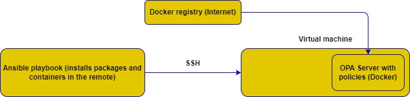

# Configuring OPA PAM on Azure VM using Ansible

The repository contains pipeline that replaces the Linux-PAM with the OPA-PAM
to perform sudo authorization using OPA server and policies baked into a docker image.

## Prototype architecture

